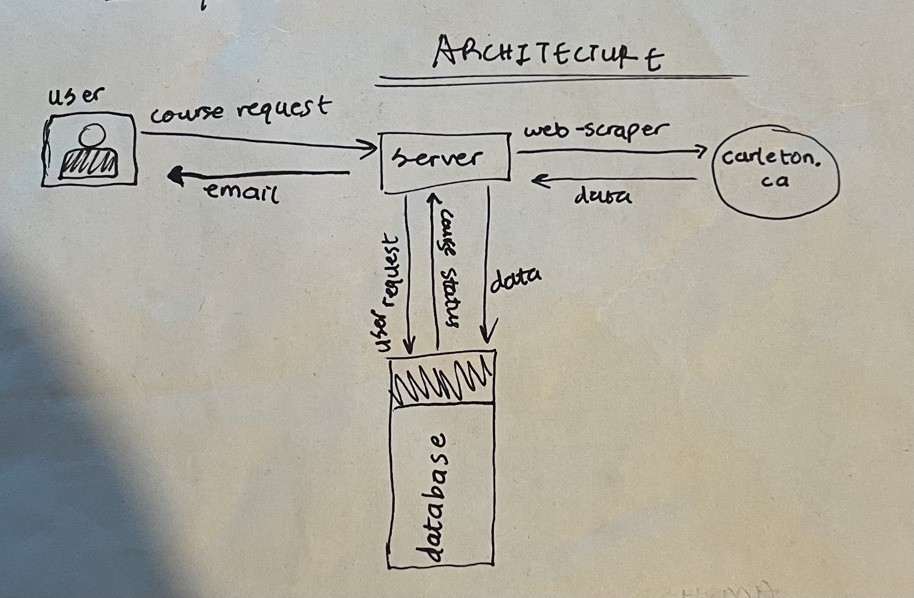

# Carleton University Course Notifier

This project is a reminder service that notifies you when a seat opens up in any class of your choice at Carleton University🎓

Available online at https://carleton-course-notifier.onrender.com/ 🌐

## Features

- Monitor multiple courses simultaneously🤹‍♀️
- Receive notifications as soon as a seat becomes available🔔
- Easy configuration for selecting courses of interest

## Tools and Frameworks
- Puppeteer
- JavaScript
- HTML/CSS
- Node.js
- Express.js
- Docker
- PostgreSQL

## Architecture

